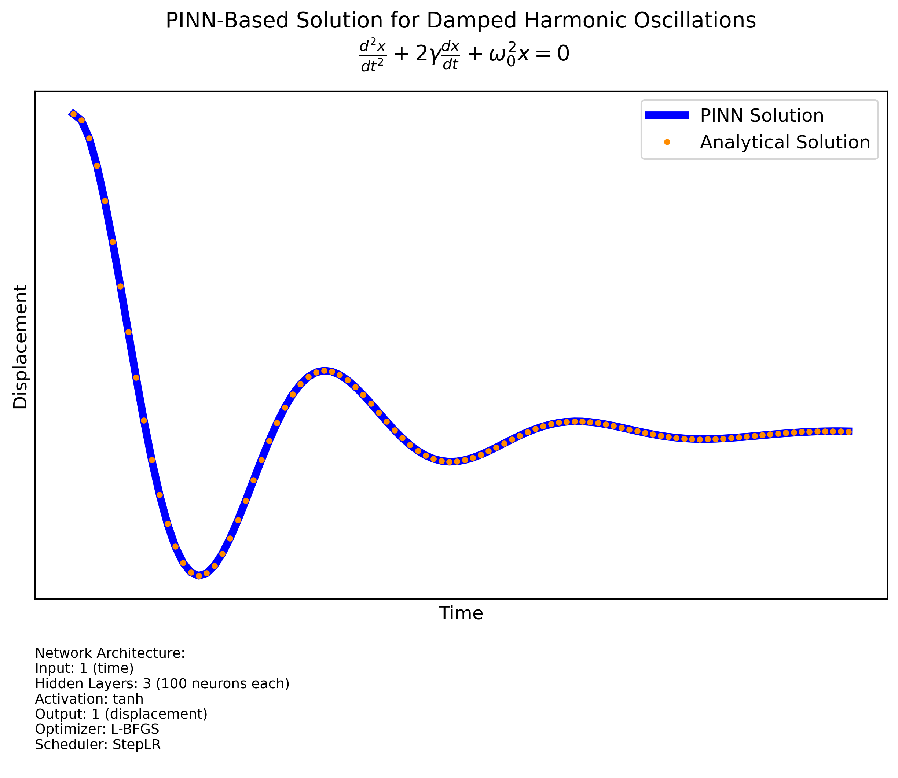

# Solving the Damped Oscillation Equation using PINN

This repository contains a Python implementation of solving the damped oscillation equation using Physics-Informed Neural Networks (PINNs). The damped oscillation equation is a second-order differential equation that describes the motion of a damped harmonic oscillator. The solution is obtained using a neural network trained to satisfy the physics of the problem.

## Table of Contents
- [Introduction](#introduction)
- [Dependencies](#dependencies)
- [PINN Architecture](#pinn-architecture)
- [Training](#training)
- [Evaluation](#evaluation)
- [Results](#results)
- [Usage](#usage)
- [License](#license)

## Introduction
The damped oscillation equation is given by:

\[ \frac{d^2x}{dt^2} + 2\gamma \frac{dx}{dt} + \omega_0^2 x = 0 \]

where:
- \( x(t) \) is the displacement as a function of time,
- \( \gamma \) is the damping coefficient,
- \( \omega_0 \) is the natural frequency.

The goal is to solve this equation using a neural network that is trained to minimize the residual of the differential equation and satisfy the initial conditions.

## Dependencies
The code requires the following Python libraries:
- `torch`
- `numpy`
- `matplotlib`

You can install these dependencies using pip:
```bash
pip install torch numpy matplotlib
```

## PINN Architecture
The neural network architecture consists of four fully connected layers with tanh activation functions. The network takes time t as input and outputs the displacement x(t).
```bash
class PINN(nn.Module):
    def __init__(self):
        super(PINN, self).__init__()
        self.fc1 = nn.Linear(1, 200)
        self.fc2 = nn.Linear(200, 200)
        self.fc3 = nn.Linear(200, 200)
        self.fc4 = nn.Linear(200, 1)

    def forward(self, t):
        t = torch.tanh(self.fc1(t))
        t = torch.tanh(self.fc2(t))
        t = torch.tanh(self.fc3(t))
        x = self.fc4(t)
        return x
```

## Training
The training process involves minimizing the physics loss and the initial condition loss. The physics loss ensures that the neural network satisfies the differential equation, while the initial condition loss ensures that the solution matches the initial conditions.
```bash
def physics_loss(net, t, gamma, omega0):
    t.requires_grad = True
    x = net(t)
    dx_dt = torch.autograd.grad(x, t, grad_outputs=torch.ones_like(x), create_graph=True)[0]
    d2x_dt2 = torch.autograd.grad(dx_dt, t, grad_outputs=torch.ones_like(dx_dt), create_graph=True)[0]
    residual = d2x_dt2 + 2 * gamma * dx_dt + omega0**2 * x
    return torch.mean(residual**2)

def initial_condition_loss(net, x0, v0):
    t0 = torch.tensor([0.0], requires_grad=True).float()
    x_pred = net(t0)
    dx_pred_dt = torch.autograd.grad(x_pred, t0, create_graph=True)[0]
    loss_ic = (x_pred - x0)**2 + (dx_pred_dt - v0)**2
    return loss_ic

def train_pinn(net, optimizer, scheduler, gamma, omega0, x0, v0, epochs=5000):
    for epoch in range(epochs):
        def closure():
            optimizer.zero_grad()
            t = torch.linspace(0, 10, 200).view(-1, 1).float()
            loss_physics = physics_loss(net, t, gamma, omega0)
            loss_ic = initial_condition_loss(net, x0, v0)
            loss_total = loss_physics + 10.0 * loss_ic
            loss_total.backward()
            return loss_total
        optimizer.step(closure)
        scheduler.step()
        if epoch % 100 == 0:
            loss_total = closure()
            print(f"Epoch {epoch}, Loss: {loss_total.item()}")
```


## Evaluation
After training, the neural network is evaluated on a test set, and the results are compared with the analytical solution.

```bash
t_test = torch.linspace(0, 10, 100).view(-1, 1).float()
x_pinn = net(t_test).detach().numpy()

plt.figure(figsize=(10, 6))
plt.plot(t_test, x_pinn, label="PINN Solution", linewidth=2)
plt.xlabel("Time (t)")
plt.ylabel("Displacement (x(t))")
plt.title("PINN Solution of Damped Oscillation")
plt.legend()
plt.grid()
plt.show()
```



## Usage
To run the code, simply execute the provided Jupyter notebook or Python script. Ensure that all dependencies are installed and that the necessary libraries are imported.